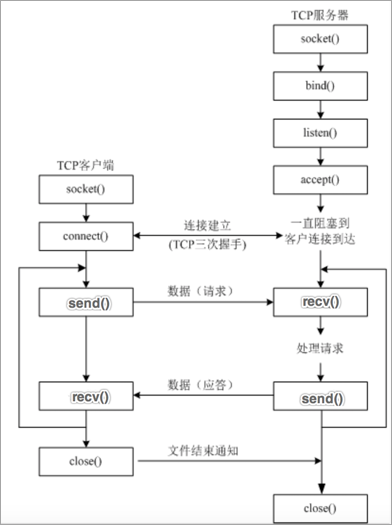
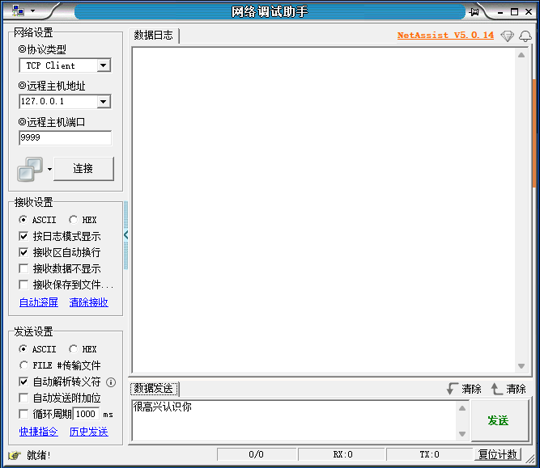
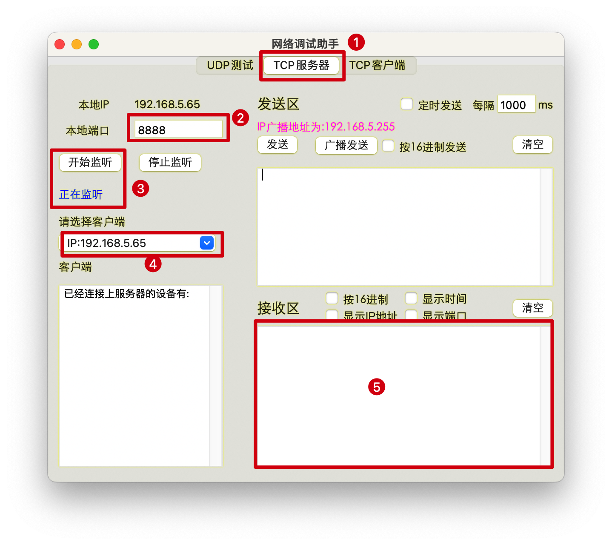

# 网络编程
## 简介
>网络编程是指利用计算机网络进行数据传输和通信的编程技术。
在网络编程中，使用编程语言和相关的网络协议来建立连接、传输数据、处理请求和响应等。

### 常见的网络编程涉及以下几个方面：

1. Socket 编程：Socket 是一种抽象的网络通信接口，可以用于在不同计算机之间建立通信连接。通过Socket编程，可以实现客户端和服务器之间的数据传输和通信。

2. 网络协议：网络协议是用于规定计算机之间通信的规则和约定。例如，HTTP（超文本传输协议）用于在Web浏览器和Web服务器之间传输数据，TCP/IP（传输控制协议/互联网协议）用于在网络上传输数据包等。

3. 客户端和服务器：在网络编程中，通常会涉及到客户端和服务器的概念。客户端是发起请求的一方，服务器是接收和处理请求的一方。客户端通过网络连接到服务器，发送请求并接收服务器的响应。

4. 数据传输和通信：网络编程可以通过套接字(Socket)来实现数据的传输和通信。客户端可以向服务器发送请求，并接收服务器返回的响应数据。这可以包括发送和接收文本、图像、音频、视频等不同类型的数据。

5. 并发与多线程：网络编程中，需要考虑多个客户端和服务器同时连接和通信的情况。使用多线程技术可以实现并发处理多个连接和请求，提高系统的性能和响应速度。

总的来说，网络编程是基于计算机网络进行数据传输和通信的编程技术。通过网络编程，可以实现客户端和服务器之间的连接和数据传输，实现各种网络应用程序。

## IP地址与端口
### IP地址
>IP 地址用来标识网络中设备的一串数字编号。也就是说通过IP地址能够找到网络中某台设备。

#### IP 地址分为两类： IPv4 和 IPv6
* IPv4 是目前使用的ip地址，是由点分十进制组成。
* IPv6 是未来使用的ip地址，是由冒号十六进制组成

### 端口
>端口是计算机网络中用于标识不同网络应用程序或服务的数字标识。每个网络应用程序或服务都会使用一个特定的端口号，
>以便其他设备通过网络与该应用程序或服务进行通信，当想要通过网络访问某个服务或应用程序时，需要指定目标设备的IP地址和端口号。

### 端口的分类
>端口号是一个 16 位的数字，共有 65536 个可用端口，范围从 0 到 65535。一般可划分为系统端口和动态端口。

* 系统端口是指范围从 0 到 1023 的端口号，常用于一些标准的服务和协议。
* 动态端口是指范围从 1024 到 65535 的端口号，用于自定义应用程序和临时连接。

但是，一些主流的第三方软件所使用的端口，默认在使用时，也应该避开，比如：MySQL 的 3306 端口，Reids 的 6379 端口等。

## 通信协议
>通信协议是用于在计算机网络上进行数据传输和交换的规则和约定。它定义了在通信过程中数据的格式、编码方式、传输速率、错误检测和纠正方法等。

>通信协议可以分为多个层级，通常采用分层模型，最著名的是 TCP/IP 协议栈。每一层都有不同的功能和责任，通过交互和协调实现端到端的可靠通信。

#### 例如，TCP/IP 协议栈包括以下层级：

1. 应用层：定义应用程序之间的通信规则，例如 HTTP、FTP、SMTP 等协议。
2. 传输层：提供端到端的数据传输服务，包括 TCP 和 UDP 等协议，负责数据的分割、传输控制、错误检测和流量控制等。
3. 网络层：处理网络间的数据传输和路由，例如 IP 协议。负责将数据包从源主机传输到目标主机，通过IP地址实现寻址和路由选择。
4. 数据链路层：处理相邻节点之间的数据传输，负责定义数据的格式和封装，以太网协议就是其中的一种。
5. 物理层：负责在物理媒介上传输比特流，例如通过电缆或无线信号传输数据。

### TCP 协议
>TCP 的英文全拼(Transmission Control Protocol)简称传输控制协议，它是一种面向连接的、可靠的、基于字节流的传输层通信协议。

#### TCP 协议特点

* 面向连接
  * 通信双方必须先建立好连接才能进行数据的传输，数据传输完成后，双方必须断开此连接，以释放系统资源。
* 可靠传输
  * TCP 采用发送应答机制
  * 超时重传
  * 错误校验
  * 流量控制
  * 阻塞管理

### HTTP协议
>HTTP（Hypertext Transfer Protocol）超文本传输协议，是一种用于在 Web 浏览器和 Web 服务器之间传输数据的协议。它是一个应用层协议，基于 TCP/IP 协议栈。

>HTTP 使用 请求-响应 模型，客户端（通常是Web浏览器）发送 HTTP 请求到 Web 服务器，服务器接收并处理请求，然后返回相应的HTTP响应给客户端。通过这种方式，HTTP 实现了客户端和服务器之间的通信和数据交换。

### HTTP报文格式
* 请求报文

| 组成   | 说明                         |
|:-----|:---------------------------|
| 请求行  | 请求方法 请求路径 请求协议版本           |
| 请求头  | 以key-value形式描述，每行以 \r\n 结束 |
| 空行   | \r\n                       |
| 请求体  | 请求时携带的数据，GET请求方式没有此部分      |

* 响应报文

| 组成   | 说明                              |
|:-----|:--------------------------------|
| 响应行	 | 响应协议版本 响应状态码 响应状态描述短语           |
| 响应头  | 以key-value形式描述的请求信息，每行以 \r\n 结束 |
| 空行   | \r\n                            |
| 响应体  | 服务器返回给客户端的数据                    |

## Socket 编程
>Socket 编程是一种网络编程的技术，用于实现不同设备之间的数据通信。
它提供了一种基于 TCP 或 UDP 协议的接口，使得程序可以通过网络套接字 socket 进行数据的发送和接收。
通过 Socket 编程，可以在不同主机之间建立网络连接，进行双向的数据传输。
 
>Socket 编程通常涉及两个角色：客户端和服务器。
在 Socket 编程中，服务器会创建一个监听套接字 listening socket，用于接收来自客户端的连接请求。一旦服务器接受了客户端的连接请求，它会创建一个新的套接字socket 与客户端进行数据的交换。
客户端会创建一个套接字 socket ，并向服务器发起连接请求。一旦服务器接受了该请求，客户端和服务器之间就可以进行数据的传输。

>Socket 编程提供了一组函数和方法，用于创建套接字、设置连接参数、发送和接收数据等操作。
常见的编程语言，如 C、Python、Java 等都提供了相应的 Socket 库和 API，供开发者进行 Socket 编程。
通过 Socket 编程，可以实现各种类型的网络应用，包括像 HTTP、FTP、SMTP 等基于各种协议的应用。它也可以用于实现自定义的网络通信，例如实时通信、游戏服务器等。
需要注意的是，Socket 编程是一种底层的网络编程技术，需要开发者有一定的网络编程基础和对网络通信原理的了解。

## Socket 开发流程
>Python 中使用 socket 模块完成网络编程，该模块是系统模块，直接导入即可使用。

### Socket 客户端及服务端开发流程如图所示：


### Socket 客户端开发流程
1. 创建客户端套接字对象
2. 和服务端套接字建立连接
3. 向服务端发送数据
4. 从服务端接收数据
5. 关闭客户端套接字 

```python
#示例代码：

# 导入 socket 模块
import socket

# 创建tcp客户端套接字
# 1. AF_INET：表示ipv4
# 2. SOCK_STREAM: tcp传输协议
tcp_client_socket = socket.socket(socket.AF_INET, socket.SOCK_STREAM)

# 和服务端应用程序建立连接
tcp_client_socket.connect(("192.168.5.65", 8888))

# 代码执行到此，说明连接建立成功
# 准备发送的数据
send_data = "你好,我是哈利波特!".encode("gbk")
# 向服务端发送数据
tcp_client_socket.send(send_data)

# 从服务端接收数据, 这次接收的数据最大字节数是1024
recv_data = tcp_client_socket.recv(1024)
# 返回的直接是服务端程序发送的二进制数据
print(recv_data)

# 对数据进行解码
recv_content = recv_data.decode("gbk")
print("接收服务端的数据为:", recv_content)

# 关闭套接字
tcp_client_socket.close()
```

#### 代码调试
>由于只编写了客户端，而没有服务端，此时的代码是无法自验证的，需要借助一个外部工具【网络调试助手】进行程序验证。（该软件需自行搜索下载安装,不同系统间软件界面有些许差异，功能基本一致）




1. 选择服务器类型为TCP服务器
2. 设置服务器运行端口号
3. 点击按钮开始监听，状态显示正在监听，等待客户端的连接请求
4. 运行客户端程序后，服务助手会将正在连接的客户端IP地址显示在此
5. 接收区显示客户端发送给服务端的数据

#### 各阶段注意事项

1. 创建客户端套接字对象
   * 目前主流使用的 IP 分类还是 IPv4
   * 指定通信方式为 TCP 方式，此时数据传递使用的是二进制字节流
   * socket 方法的两个参数都可以省略，默认使用 IPv4 建立 TCP 方式的套接字
2. 和服务端套接字建立连接 
   * 连接服务器时，需要指定服务器 IP 和端口号，需要向服务器确认，添入正确数据
   * IP 与端口需要使用元组形式传入
3. 向服务端发送数据
   * 程序中的默认字符串数据，都是 str 类型，不能直接进行传输。
   * TCP 方式传输数据必须是二进制数据。
   * 需要将要传输的数据使用 encode()方法进行数据编码，转换成二进制数据
4. 从服务端接收数据
   * 服务端发送给客户端的数据，也是使用二进制方式进行传输的，所以需要使用decode()方法对数据解码
5. 关闭客户端套接字
   * 数据传输结束后，需要将连接进行关闭

### Socket 服务端开发流程
1. 创建服务端端套接字对象
2. 设置端口复用
3. 绑定服务端口号
4. 设置监听
5. 等待接受客户端的连接请求
6. 接收客户端发送数据
7. 向客户端发送数据
8. 关闭套接字

```python
#示例代码：
import socket

# 创建tcp服务端套接字
tcp_server_socket = socket.socket(socket.AF_INET, socket.SOCK_STREAM)
# 设置端口号复用，让程序退出端口号立即释放
tcp_server_socket.setsockopt(socket.SOL_SOCKET, socket.SO_REUSEADDR, True)
# 给程序绑定端口号
tcp_server_socket.bind(("", 8888))
# 设置监听
tcp_server_socket.listen(128)
print("服务端启动成功，等待客户端连接。。。")
# 等待客户端建立连接的请求, 只有客户端和服务端建立连接成功代码才会解阻塞，代码才能继续往下执行
# 1. 专门和客户端通信的套接字： client_socket
# 2. 客户端的ip地址和端口号： ip_port
client_socket, ip_port = tcp_server_socket.accept()
# 代码执行到此说明连接建立成功
print("客户端的ip地址和端口号:", ip_port)
# 接收客户端发送的数据, 这次接收数据的最大字节数是1024
recv_data = client_socket.recv(1024)
# 获取数据的长度
recv_data_length = len(recv_data)
print("接收数据的长度为:", recv_data_length)
# 对二进制数据进行解码
recv_content = recv_data.decode("gbk")
print("接收客户端的数据为:", recv_content)
# 准备发送的数据
send_data = f"你好,{ip_port[0]}".encode("gbk")
# 发送数据给客户端
client_socket.send(send_data)
# 关闭服务与客户端的套接字， 终止和客户端通信的服务
client_socket.close()
# 关闭服务端的套接字, 终止和客户端提供建立连接请求的服务
tcp_server_socket.close()
```
#### 代码调试
>服务端代码调试时，可以使用之前编写的客户端代码，也可以使用网络调试助手。
 
1. 选择 TCP 客户端
2. 设置端口号为服务器绑定的端口
3. 点击连接按钮，连接状态显示连接成功
4. 在发送区向服务器发送数据
5. 在接收区显示服务器发送的数据

#### 注意事项
1. 创建服务端端套接字对象
   * 同创建客户端一样，需要指定IP类型和服务器传输协议类型
2. 设置端口复用
   * 端口在停止使用后的一段时间内是不能重新启用的
   * 为了方便调试程序，设置 socket 选项，可以立即启用端口
3. 绑定服务端口号
   * 服务器的端口号应该绑定一个固定端口号，方便客户端连接
4. 设置监听
   * 设置监听后，服务器 socket 变成被动模式，不能使用服务器 socket 收发消息
   * 128:最大等待建立连接的个数
5. 等待接受客户端的连接请求
   * 服务器进入到阻塞状态，直到有客户端连接
   * 接收到客户端请求连接后，返回客户端 socket 对象及客户端 IP 和端口
6. 接收客户端发送数据
   * 使用客户端 socket 对象接收客户端向服务端发送的数据
   * 数据需要进行解码使用
7. 向客户端发送数据
   * 使用客户端 socket 对象向客户端发送数据
   * 数据需要进行编码使用
8. 关闭套接字
   * 数据发送完毕后，服务器可以使用客户端 socket 对象将客户端连接断开
   * 服务端 socket 视情况断开连接

## 多任务服务端
>结合多任务实现可以多个客户端同时访问的服务端。

```python
import socket
import threading

class MultiTaskTCPServer(object):
    # 在初始化方法中对服务端socket进行初始化操作
    def __init__(self,ip="", port=8888):
        # 创建tcp服务端套接字
        self.server = socket.socket(socket.AF_INET, socket.SOCK_STREAM)
        # 设置端口号复用，让程序退出端口号立即释放
        self.server.setsockopt(socket.SOL_SOCKET, socket.SO_REUSEADDR, True)
        # 绑定端口号
        self.server.bind((ip, port))
        # 设置监听, listen后的套接字是被动套接字，只负责接收客户端的连接请求
        self.server.listen(128)

    # 启动服务器方法，实现多任务接受处理客户端连接请求
    def run(self):
        # 循环等待接收客户端的连接请求
        while True:
            # 等待接收客户端的连接请求
            client_socket, ip_port = self.server.accept()
            print("客户端连接成功:", ip_port)
            # 当客户端和服务端建立连接成功以后，需要创建一个子线程，不同子线程负责接收不同客户端的消息
            sub_thread = threading.Thread(target=self.handle_client_request, args=(client_socket, ip_port))
            # 设置守护主线程
            sub_thread.setDaemon(True)
            # 启动子线程
            sub_thread.start()

        # tcp服务端套接字可以不需要关闭，因为服务端程序需要一直运行
        tcp_server_socket.close()

    # 处理客户端的请求操作
    def handle_client_request(self, client, ip_port):
        # 接收客户端发送的数据并解码
        recv_data = client.recv(1024).decode("gbk")
        # 如果接收的数据长度为0，说明客户端主动断开了连接
        if len(recv_data) == 0:
            print("客户端下线了:", ip_port)
            return

        print(recv_data, ip_port)
        # 将客户端发送的数据转换成大写并编码后发送给客户端
        send_data = recv_data.upper().encode("gbk")
        client.send(send_data)

        # 终止和客户端进行通信
        client.close()


if __name__ == '__main__':
    # 创建服务器对象
    server = MultiTaskTCPServer(port=9999)
    # 启动服务器
    server.run()
```